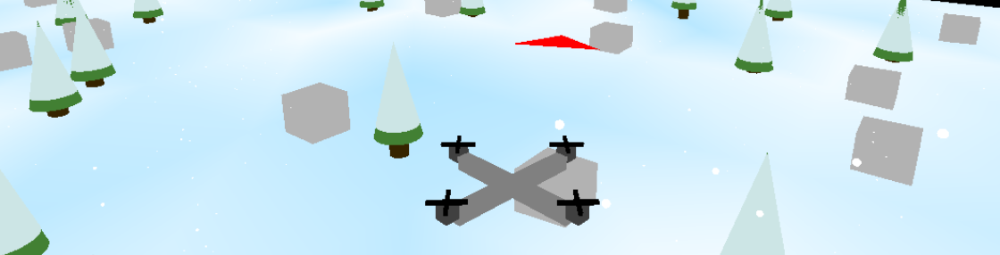
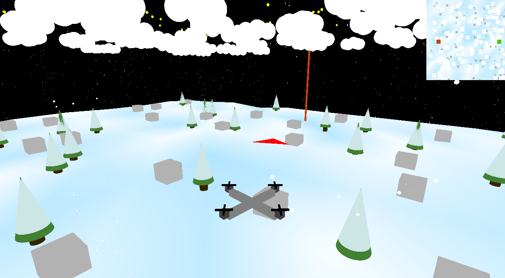
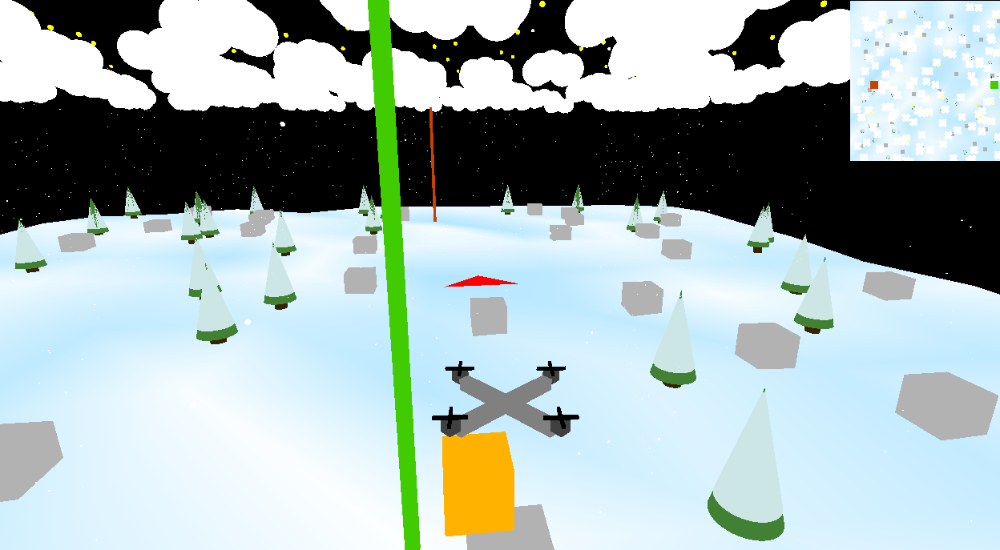

# Drone Delivery Simulation

## Overview
This project is a **drone delivery simulation** built using **OpenGL** and **C++**. The simulation includes a 3D environment where a drone is controlled to pick up and deliver packages while navigating obstacles such as trees, buildings, and snow. The game also features terrain generation, a minimap, collision detection, and interactive controls.

## Features
- **3D Drone Simulation**: A fully interactive drone that can fly, rotate, and navigate through the environment.
- **Package Delivery**: The drone can pick up and deliver packages to designated locations.
- **Obstacles & Environment**: Procedurally generated trees, buildings, snow particles, and clouds.
- **Minimap**: A minimap for better navigation and planning routes.
- **Collision Detection**: Ensures realistic interaction between the drone and obstacles.
- **Dynamic Terrain Generation**: Terrain is generated with randomized elements.
- **Shaders**: Uses vertex and fragment shaders for rendering graphics.

## File Structure
```
Drone-Delivery/
│── Drone_Delivery.cpp   # Main simulation logic
│── Drone_Delivery.h     # Class definition
│── T2camera.h           # Camera implementation
│── T2object3D.cpp       # 3D Object creation (cubes, cylinders, cones, etc.)
│── T2object3D.h         # 3D Object class definition
│── T2transform3D.h      # 3D Transformations (translate, rotate, scale)
│── shaders/
│   │── VertexShader.glsl     # Vertex shader for rendering
│   │── FragmentShader.glsl   # Fragment shader for rendering
```

## Compilation & Execution

1. **Clone the repository:**
   ```sh
   git clone https://github.com/robertpaulp/Drone-Delivery.git
   cd Drone-Delivery
   ```
2. **Build and Run on Windows:**
    - Install Visual Studio (with "Desktop development with C++" module)
    - Install CMake
    - Open CMake GUI:
      - Set source code path to project root
      - Set build path to `build` directory
      - Click Configure and Generate
      - Click "Open Project" to launch Visual Studio
    - In Visual Studio:
      - Build and Run the solution

    Note: Source code for the Drone Delivery game is located in `src/lab_m1/Drone-Delivery/`.

## Controls
- **W, A, S, D** - Move the drone forward, left, backward, and right.
- **Q, E** - Rotate the drone left and right.
- **R, F** - Move the drone up and down.
- **Space** - Pick up a package.
- **M** - Drop the package.

## Screenshots





